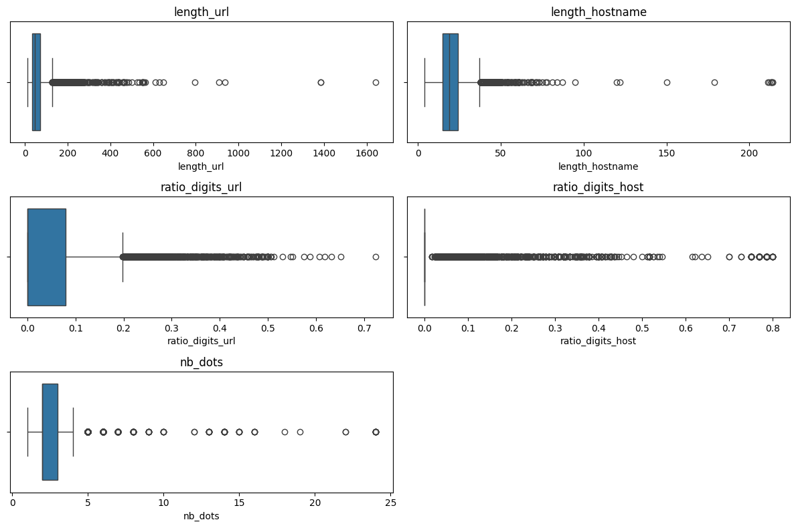
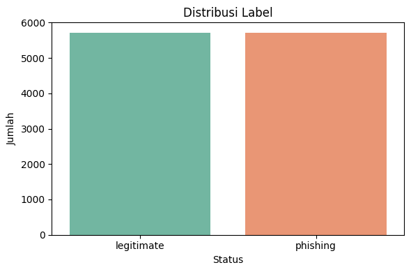
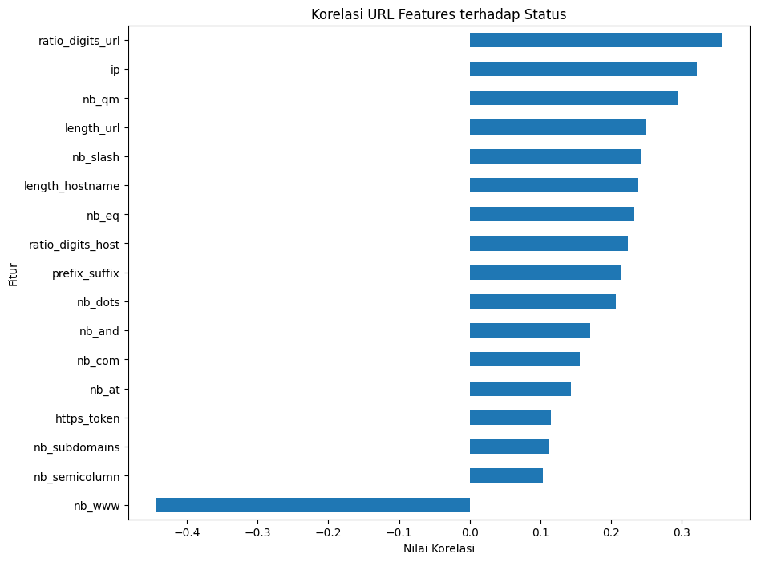
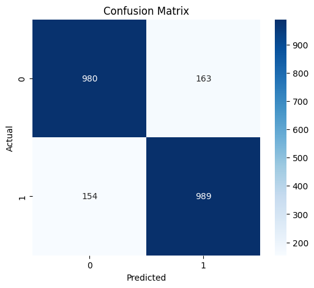
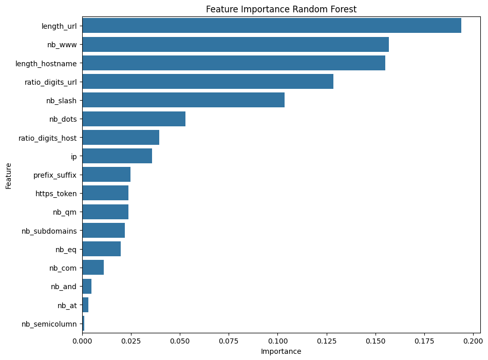

# Laporan Proyek Machine Learning - Deteksi URL Phishing Menggunakan Random Forest

## Project Overview

Perkembangan internet yang semakin pesat menyebabkan meningkatnya jumlah serangan siber, salah satunya adalah phishing. Phishing merupakan teknik penipuan yang dilakukan dengan membuat situs web palsu yang menyerupai situs resmi untuk mencuri informasi sensitif pengguna, seperti username, password, data kartu kredit, dan informasi pribadi lainnya.

Banyak pengguna internet kesulitan membedakan URL asli dan URL phishing karena tampilan situs yang sangat mirip dengan situs resmi. Oleh karena itu, diperlukan sistem yang mampu melakukan klasifikasi URL secara otomatis untuk membantu pengguna mengidentifikasi potensi ancaman phishing sebelum mengakses suatu situs web.

Pada proyek ini dibangun model Machine Learning menggunakan algoritma Random Forest untuk mengklasifikasikan URL menjadi kategori Legitimate atau Phishing berdasarkan karakteristik URL.

### Manfaat Proyek

* Membantu mendeteksi URL phishing secara otomatis.
* Mengurangi risiko pengguna mengakses situs berbahaya.
* Mendukung pengembangan sistem keamanan siber berbasis Machine Learning.

Foormat Referensi: [PHISING LINK DETECTION](https://jurnal.amikom.ac.id/index.php/intechno/article/view/1562)

---

# Business Understanding

## Problem Statements

1. Bagaimana membangun model Machine Learning yang mampu mengklasifikasikan URL phishing dan legitimate?
2. Fitur URL apa saja yang paling berpengaruh dalam membedakan URL phishing dan legitimate?
3. Seberapa baik performa algoritma Random Forest dalam mendeteksi URL phishing?

## Goals

1. Mengembangkan model klasifikasi URL phishing.
2. Mengidentifikasi fitur-fitur yang memiliki pengaruh besar terhadap status phishing.
3. Mengevaluasi performa model menggunakan metrik klasifikasi.

## Solution Statements

Pendekatan yang digunakan dalam proyek ini meliputi:

* Data Cleaning.
* Feature Engineering menggunakan analisis korelasi Pearson.
* Feature Selection berdasarkan nilai korelasi terhadap target.
* Random Forest Classifier sebagai algoritma klasifikasi.
* Evaluasi menggunakan Accuracy, Precision, Recall, dan F1-Score.
* Deployment menggunakan Gradio dan Hugging Face Spaces

---

# Data Understanding

Dataset yang digunakan merupakan dataset URL phishing yang terdiri dari berbagai fitur karakteristik URL dan website.

## Informasi Dataset

### Ukuran Dataset

```python
"Shape:", df.shape
```

| Keterangan   | Nilai  |
| ------------ | ------ |
| Jumlah Data  | 11.430 |
| Jumlah Fitur | 89     |
| Target       | status |


### Informasi Dataset

```python
df.info()
```

```text
<class 'pandas.core.frame.DataFrame'>
RangeIndex: 11430 entries, 0 to 11429
Data columns (total 89 columns):
```

| No | Column                     | Non-Null Count | Data Type |
| -- | -------------------------- | -------------- | --------- |
| 0  | url                        | 11430 non-null | object    |
| 1  | length_url                 | 11430 non-null | int64     |
| 2  | length_hostname            | 11430 non-null | int64     |
| 3  | ip                         | 11430 non-null | int64     |
| 4  | nb_dots                    | 11430 non-null | int64     |
| 5  | nb_hyphens                 | 11430 non-null | int64     |
| 6  | nb_at                      | 11430 non-null | int64     |
| 7  | nb_qm                      | 11430 non-null | int64     |
| 8  | nb_and                     | 11430 non-null | int64     |
| 9  | nb_or                      | 11430 non-null | int64     |
| 10 | nb_eq                      | 11430 non-null | int64     |
| 11 | nb_underscore              | 11430 non-null | int64     |
| 12 | nb_tilde                   | 11430 non-null | int64     |
| 13 | nb_percent                 | 11430 non-null | int64     |
| 14 | nb_slash                   | 11430 non-null | int64     |
| 15 | nb_star                    | 11430 non-null | int64     |
| 16 | nb_colon                   | 11430 non-null | int64     |
| 17 | nb_comma                   | 11430 non-null | int64     |
| 18 | nb_semicolumn              | 11430 non-null | int64     |
| 19 | nb_dollar                  | 11430 non-null | int64     |
| 20 | nb_space                   | 11430 non-null | int64     |
| 21 | nb_www                     | 11430 non-null | int64     |
| 22 | nb_com                     | 11430 non-null | int64     |
| 23 | nb_dslash                  | 11430 non-null | int64     |
| 24 | http_in_path               | 11430 non-null | int64     |
| 25 | https_token                | 11430 non-null | int64     |
| 26 | ratio_digits_url           | 11430 non-null | float64   |
| 27 | ratio_digits_host          | 11430 non-null | float64   |
| 28 | punycode                   | 11430 non-null | int64     |
| 29 | port                       | 11430 non-null | int64     |
| 30 | tld_in_path                | 11430 non-null | int64     |
| 31 | tld_in_subdomain           | 11430 non-null | int64     |
| 32 | abnormal_subdomain         | 11430 non-null | int64     |
| 33 | nb_subdomains              | 11430 non-null | int64     |
| 34 | prefix_suffix              | 11430 non-null | int64     |
| 35 | random_domain              | 11430 non-null | int64     |
| 36 | shortening_service         | 11430 non-null | int64     |
| 37 | path_extension             | 11430 non-null | int64     |
| 38 | nb_redirection             | 11430 non-null | int64     |
| 39 | nb_external_redirection    | 11430 non-null | int64     |
| 40 | length_words_raw           | 11430 non-null | int64     |
| 41 | char_repeat                | 11430 non-null | int64     |
| 42 | shortest_words_raw         | 11430 non-null | int64     |
| 43 | shortest_word_host         | 11430 non-null | int64     |
| 44 | shortest_word_path         | 11430 non-null | int64     |
| 45 | longest_words_raw          | 11430 non-null | int64     |
| 46 | longest_word_host          | 11430 non-null | int64     |
| 47 | longest_word_path          | 11430 non-null | int64     |
| 48 | avg_words_raw              | 11430 non-null | float64   |
| 49 | avg_word_host              | 11430 non-null | float64   |
| 50 | avg_word_path              | 11430 non-null | float64   |
| 51 | phish_hints                | 11430 non-null | int64     |
| 52 | domain_in_brand            | 11430 non-null | int64     |
| 53 | brand_in_subdomain         | 11430 non-null | int64     |
| 54 | brand_in_path              | 11430 non-null | int64     |
| 55 | suspecious_tld             | 11430 non-null | int64     |
| 56 | statistical_report         | 11430 non-null | int64     |
| 57 | nb_hyperlinks              | 11430 non-null | int64     |
| 58 | ratio_intHyperlinks        | 11430 non-null | float64   |
| 59 | ratio_extHyperlinks        | 11430 non-null | float64   |
| 60 | ratio_nullHyperlinks       | 11430 non-null | int64     |
| 61 | nb_extCSS                  | 11430 non-null | int64     |
| 62 | ratio_intRedirection       | 11430 non-null | int64     |
| 63 | ratio_extRedirection       | 11430 non-null | float64   |
| 64 | ratio_intErrors            | 11430 non-null | int64     |
| 65 | ratio_extErrors            | 11430 non-null | float64   |
| 66 | login_form                 | 11430 non-null | int64     |
| 67 | external_favicon           | 11430 non-null | int64     |
| 68 | links_in_tags              | 11430 non-null | float64   |
| 69 | submit_email               | 11430 non-null | int64     |
| 70 | ratio_intMedia             | 11430 non-null | float64   |
| 71 | ratio_extMedia             | 11430 non-null | float64   |
| 72 | sfh                        | 11430 non-null | int64     |
| 73 | iframe                     | 11430 non-null | int64     |
| 74 | popup_window               | 11430 non-null | int64     |
| 75 | safe_anchor                | 11430 non-null | float64   |
| 76 | onmouseover                | 11430 non-null | int64     |
| 77 | right_clic                 | 11430 non-null | int64     |
| 78 | empty_title                | 11430 non-null | int64     |
| 79 | domain_in_title            | 11430 non-null | int64     |
| 80 | domain_with_copyright      | 11430 non-null | int64     |
| 81 | whois_registered_domain    | 11430 non-null | int64     |
| 82 | domain_registration_length | 11430 non-null | int64     |
| 83 | domain_age                 | 11430 non-null | int64     |
| 84 | web_traffic                | 11430 non-null | int64     |
| 85 | dns_record                 | 11430 non-null | int64     |
| 86 | google_index               | 11430 non-null | int64     |
| 87 | page_rank                  | 11430 non-null | int64     |
| 88 | status                     | 11430 non-null | object    |


* Total Records: **11,430**
* Total Features: **89**
* Integer Features: **74**
* Float Features: **13**
* Object Features: **2**
* Missing Values: **0**
* Memory Usage: **7.8 MB**


Dataset terdiri dari berbagai fitur numerik yang merepresentasikan karakteristik URL dan website.

## Target Label

| Nilai | Keterangan |
| ----- | ---------- |
| 0     | Legitimate |
| 1     | Phishing   |

---

## Uraian Fitur yang Digunakan
SIstem ini berfokus pada fitur URL-based detection sehingga hanya digunakan 17 fitur URL yang memiliki korelasi tertinggi terhadap target.

| Fitur             | Deskripsi                           |
| ----------------- | ----------------------------------- |
| nb_www            | Jumlah kemunculan "www"             |
| ratio_digits_url  | Rasio angka dalam URL               |
| ip                | Penggunaan alamat IP                |
| nb_qm             | Jumlah karakter (?)                 |
| length_url        | Panjang URL                         |
| nb_slash          | Jumlah karakter (/)                 |
| nb_eq             | Jumlah karakter (=)                 |
| length_hostname   | Panjang hostname                    |
| ratio_digits_host | Rasio angka pada hostname           |
| prefix_suffix     | Penggunaan tanda "-"                |
| nb_dots           | Jumlah titik (.)                    |
| nb_and            | Jumlah karakter (&)                 |
| nb_com            | Jumlah kemunculan ".com"            |
| nb_at             | Jumlah karakter (@)                 |
| nb_subdomains     | Jumlah subdomain                    |
| https_token       | Kemunculan kata https pada hostname |
| nb_semicolumn     | Jumlah karakter (;)                 |

## Missing Values

Pemeriksaan nilai kosong (missing values) dilakukan untuk memastikan kualitas data sebelum proses preprocessing dan pelatihan model.

```python
df.isnull().sum()
```

### Hasil Pemeriksaan

```text
Total Missing Values : 0
```

| Keterangan                | Nilai |
| ------------------------- | ----- |
| Total Kolom               | 89    |
| Total Missing Values      | 0     |
| Persentase Missing Values | 0%    |

### Detail Missing Values per Kolom

| Column          | Missing Values |
| --------------- | -------------- |
| url             | 0              |
| length_url      | 0              |
| length_hostname | 0              |
| ip              | 0              |
| nb_dots         | 0              |
| ...             | ...            |
| web_traffic     | 0              |
| dns_record      | 0              |
| google_index    | 0              |
| page_rank       | 0              |
| status          | 0              |


### Hasil Analisis

Dataset tidak memiliki nilai yang hilang (*missing values*) pada seluruh 89 fitur. Oleh karena itu, tidak diperlukan proses penanganan missing value seperti imputasi atau penghapusan data sebelum tahap preprocessing dan pelatihan model.

---

## Data Duplikat

Dilakukan pemeriksaan data duplikat menggunakan:

```python
df.duplicated().sum()
```

Data duplikat ditemukan dan dihapus pada tahap Data Preparation.

```python
df.drop_duplicates(inplace=True)
```
==================================================
DATA DUPLIKAT
==================================================
Jumlah data duplikat : 0

## Outlier

Outlier dianalisis menggunakan metode Interquartile Range (IQR) pada beberapa fitur utama seperti:

* length_url
* length_hostname
* ratio_digits_url
* ratio_digits_host
* nb_dots



## Distribusi Label

```python
label_counts = df['status'].value_counts()
print(label_counts)

plt.figure(figsize=(6,4))
sns.countplot(x='status', data=df, palette='Set2')
plt.title('Distribusi Label: Phishing vs Legitimate')
plt.xlabel('Status')
plt.ylabel('Jumlah')
plt.tight_layout()
plt.savefig('label_distribution.png')
plt.show()
```
### Hasil Distribusi
status
legitimate    5715
phishing      5715
Name: count, dtype: int64
/tmp/ipykernel_2533/1605270780.py:6: FutureWarning: 



### Hasil Analisis

Distribusi data menunjukkan bahwa jumlah URL phishing dan legitimate relatif seimbang sehingga tidak diperlukan teknik penanganan data imbalance seperti oversampling maupun undersampling.

---

# Data Preparation

Tahap data preparation dilakukan untuk memastikan kualitas data sebelum digunakan pada proses pemodelan.

## Tipe Data

### Memeriksa tipe data feature

``` Python
print(df.dtypes)
```
### Hasil memeriksa tipe data
length_url         int64
length_hostname    int64
ip                 int64
nb_dots            int64
nb_hyphens         int64
                   ...  
web_traffic        int64
dns_record         int64
google_index       int64
page_rank          int64
status             int64
Length: 88, dtype: object


## Data Cleaning

Menghapus data yang memiliki nilai kosong.

```python
df.dropna(inplace=True)
```

Karena dataset tidak memiliki missing value, jumlah data tidak berubah setelah proses cleaning.

---

### Menghapus Data Duplikat

```python
df.drop_duplicates(inplace=True)
```

### Encoding Target

```python
LabelEncoder()
```

Hasil encoding:

| Label Asli | Hasil |
| ---------- | ----- |
| legitimate | 0     |
| phishing   | 1     |

### Menghapus Kolom URL

Kolom URL tidak digunakan secara langsung karena model menggunakan fitur numerik hasil ekstraksi URL.

```python
df.drop(columns=['url'])
```

---

## Feature Engineering

Pada tahap ini dilakukan analisis korelasi untuk mengetahui hubungan masing-masing fitur terhadap target `status`.

### Analisis Korelasi

```python
corr_matrix = df.corr()

corr_status = corr_matrix['status'].sort_values(
    ascending=False
)
```

### Hasil Korelasi Tertinggi

| Fitur            | Korelasi |
| ---------------- | -------- |
| nb_www           | 0.438    |
| ratio_digits_url | 0.356    |
| ip               | 0.324    |
| nb_qm            | 0.298    |
| length_url       | 0.253    |



---

## Feature Selection

Pemilihan fitur dilakukan menggunakan threshold korelasi absolut lebih besar dari 0.2.

```python
selected_features = corr_abs[
    corr_abs > 0.2
].index

selected_features = selected_features.drop('status')
```
Dipilih 17 fitur URL yang memiliki korelasi tertinggi terhadap target.

Jumlah fitur akhir:

```text
17 fitur
```

# Modeling

## Algoritma

Model yang digunakan adalah Random Forest Classifier.

```python
RandomForestClassifier(
    n_estimators=200,
    random_state=42
)
```

### Alasan Pemilihan Algoritma

Random Forest dipilih karena mampu menangani data berdimensi tinggi, mengurangi risiko overfitting, serta menyediakan informasi feature importance yang berguna dalam proses analisis fitur.


## Data Splitting

Dataset dibagi menjadi:

* 80% Training Data
* 20% Testing Data

```python
train_test_split(
    test_size=0.2,
    stratify=y
)
```

---

# Evaluation

Evaluasi model dilakukan menggunakan:

* Accuracy
* Precision
* Recall
* F1-Score
* Confusion Matrix

## Hasil Evaluasi

| Metrik    | Nilai  |
| --------- | ------ |
| Accuracy  | 0.9593 |
| Precision | 0.9541 |
| Recall    | 0.9650 |
| F1 Score  | 0.9595 |

## Classification Report

| Class      | Precision | Recall | F1-Score |
| ---------- | --------- | ------ | -------- |
| Legitimate | 0.96      | 0.95   | 0.96     |
| Phishing   | 0.95      | 0.97   | 0.96     |


## Confusion Matrix



## Feature Importance

Fitur yang paling berpengaruh berdasarkan Random Forest:

1. ratio_digits_url
2. length_url
3. length_hostname
4. nb_qm
5. prefix_suffix



---

# Deployment

Model yang telah dilatih disimpan menggunakan format Pickle (.pkl).

```python
pickle.dump(rf, file)
```

File model:

```text
url_phishing_model.pkl
```

## Gradio Interface

Aplikasi web dibangun menggunakan Gradio untuk memungkinkan pengguna melakukan prediksi secara langsung dengan memasukkan URL.

Fitur:

* Input URL
* Ekstraksi fitur otomatis
* Prediksi phishing atau legitimate
* Tampilan hasil secara real-time

## Hugging Face Spaces

Aplikasi berhasil di-deploy menggunakan Hugging Face Spaces sehingga dapat diakses melalui browser tanpa instalasi tambahan.

### URL Deployment

```text
https://huggingface.co/spaces/daniessbynsptr/phishing-url-detector
```


### Contoh Pengujian

| URL                                     | Prediksi   |
| --------------------------------------- | ---------- |
| https://google.com                      | Legitimate |
| http://paypal-login-security-update.com | Phishing   |
| https://verify-account-google.com/login | Phishing   |

---

# Kesimpulan

Model Random Forest berhasil digunakan untuk mendeteksi URL phishing berdasarkan karakteristik URL dengan performa yang sangat baik.

Hasil evaluasi menunjukkan:

* Accuracy : 95.93%
* Precision : 95.41%
* Recall : 96.50%
* F1 Score : 95.95%

Model berhasil diimplementasikan dalam bentuk aplikasi web menggunakan Gradio dan telah di-deploy ke Hugging Face Spaces sehingga dapat digunakan secara online untuk melakukan deteksi URL phishing secara real-time.
